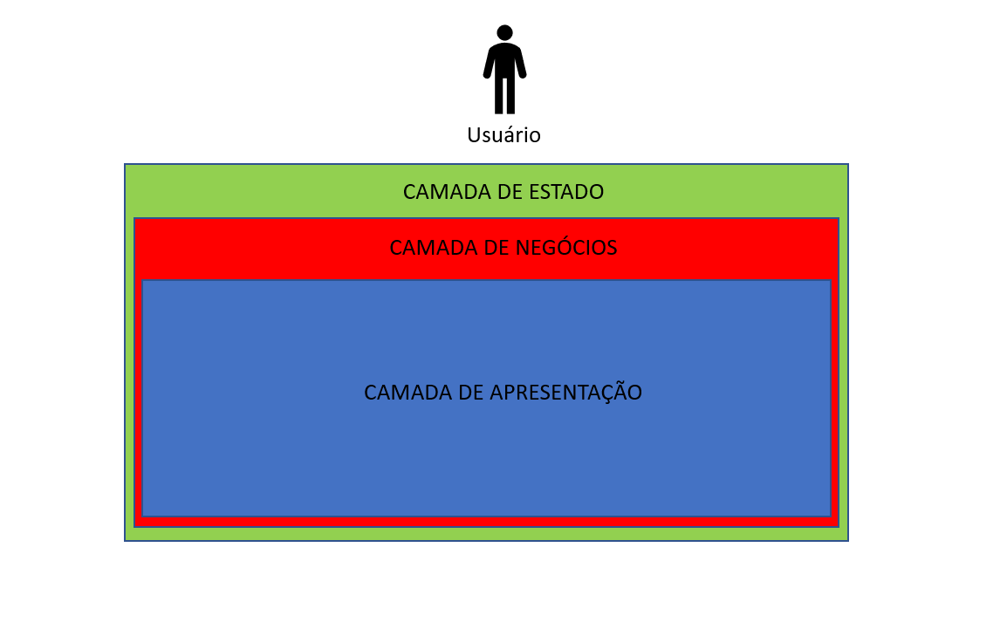

 Histórico de revisões
 
|     DATA      |    VERSÃO     |     DESCRIÇÃO    |      AUTOR               |
| ------------- | ------------- | -----------------|--------------------------|
| 06/12/2022    |     1.0       | Documento inicial|Eduardo de Souza Magalhães, jean Clayton Oliveira|

Introdução

Este documento tem por objetivo dar maior compreensão ao leitor quanto a como funciona e está estruturado está aplicação, descrevendo as camadas da aplicação, os mecanimos estruturais(escopos), casos de uso e os componentes presentes.

Visão Geral

